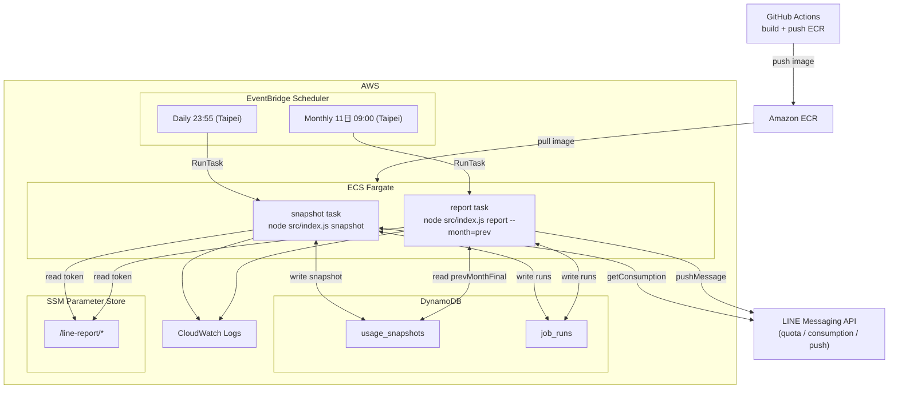

# LINE 訊息用量回報服務 — 完整建置計畫

**日期**：2026-02-25
**狀態**：全部完成

---

## 建置任務清單

| 任務 | 說明 | 狀態 |
|------|------|------|
| `pkg-setup` | 建立 package.json（dependencies / devDependencies）與 .env.example | ✅ |
| `lib-logger` | 實作 src/lib/logger.js（pino，JSON 格式，含 requestId context）| ✅ |
| `lib-date` | 實作 src/lib/date.js（luxon，Asia/Taipei，monthKey/dateKey/prevMonthKey 工具）| ✅ |
| `lib-lineapi` | 實作 src/lib/lineApi.js（getQuota / getConsumption / pushMessage，完整錯誤處理）| ✅ |
| `lib-db` | 實作 src/lib/db.js（DynamoDB DocumentClient v3，put/get/query/update helpers）| ✅ |
| `lib-storage` | 實作 src/lib/storage.js（writeSnapshot conditional put、markPrevMonthFinal、getPrevMonthFinalSnapshot）| ✅ |
| `lib-pricing` | 實作 src/lib/pricing.js（single / tiers 兩種計費模型，additionalCount + fee 計算）| ✅ |
| `action-snapshot` | 實作 src/actions/snapshot.js（幂等快照流程 + 跨月偵測 + job_runs 紀錄）| ✅ |
| `action-report` | 實作 src/actions/report.js（prevMonthFinal 查詢 + 費用計算 + LINE push + 繁中訊息格式）| ✅ |
| `src-index` | 實作 src/index.js（CLI entry，解析 snapshot/report 指令與參數）| ✅ |
| `dockerfile` | 建立 Dockerfile（node:20-alpine，CMD 設定）| ✅ |
| `cdk-setup` | 建立 iac/ CDK 專案（package.json, tsconfig.json, cdk.json, bin/app.ts）| ✅ |
| `cdk-database` | 實作 iac/lib/database-stack.ts（DynamoDB 兩張表，RemovalPolicy.RETAIN）| ✅ |
| `cdk-ecr` | 實作 iac/lib/ecr-stack.ts（ECR Repository，lifecycle policy）| ✅ |
| `cdk-ecs` | 實作 iac/lib/ecs-stack.ts（ECS Cluster + Task Definition + IAM；image tag 透過 CDK context 傳入，禁用 latest）| ✅ |
| `cdk-scheduler` | 實作 iac/lib/scheduler-stack.ts（兩條 EventBridge Schedule，Asia/Taipei timezone）| ✅ |
| `cdk-ssm` | 實作 iac/lib/ssm-stack.ts（SSM Parameter Store placeholder 定義）| ✅ |
| `cdk-monitoring` | 實作 iac/lib/monitoring-stack.ts（CloudWatch Log Group + SNS alarm 接口）| ✅ |
| `github-actions` | 建立 .github/workflows/deploy.yml（OIDC + ECR push version/sha tag，不推 latest）| ✅ |
| `readme` | 撰寫 README.md（繁中，含參數說明、本機執行、AWS 部署、回滾、log 查詢、測試）| ✅ |
| `test-pricing` | 撰寫 src/__tests__/pricing.test.js（node:test，single/tiers 邊界、free quota 扣除）| ✅ |
| `test-date` | 撰寫 src/__tests__/date.test.js（跨年月邊界、monthKey/prevMonthKey、時區正確性）| ✅ |
| `test-storage` | 撰寫 src/__tests__/storage.test.js（aws-sdk-client-mock，補封存路徑與 idempotent 防重）| ✅ |
| `script-dry-run` | 撰寫 scripts/dry-run.js（DynamoDB Local，驗證完整 snapshot→report 流程）| ✅ |

---

## 技術選型摘要

- Runtime: Node.js 20, ES Modules (`type: module`)
- 日期處理: `luxon`（Asia/Taipei 為主，DB 存 UTC）
- DB: AWS DynamoDB（2 張表）
- 容器: Docker node:20-alpine，推送至 Amazon ECR
- IaC: AWS CDK v2（TypeScript）
- 排程: EventBridge Scheduler（含 `timezone: Asia/Taipei`）
- CI/CD: GitHub Actions

---

## 最終目錄結構

```
/
├── src/
│   ├── index.js                  # CLI entry: snapshot / report
│   ├── actions/
│   │   ├── snapshot.js           # 執行每日快照
│   │   └── report.js             # 執行每月回報
│   ├── lib/
│   │   ├── lineApi.js            # LINE API 封裝（quota/consumption/push）
│   │   ├── db.js                 # DynamoDB DocumentClient + 基礎操作
│   │   ├── storage.js            # 快照 CRUD + prevMonthFinal 標記邏輯
│   │   ├── pricing.js            # 計費模型（single / tiers）
│   │   ├── date.js               # Asia/Taipei 月份/日期工具（luxon）
│   │   └── logger.js             # pino logger（JSON 格式，CloudWatch 友好）
│   └── __tests__/
│       ├── pricing.test.js       # pricing.js 單元測試（純函式，無外部依賴）
│       ├── date.test.js          # date.js 單元測試（月份邊界、跨年）
│       └── storage.test.js       # storage.js 整合測試（aws-sdk-client-mock）
├── scripts/
│   └── dry-run.js                # 本機手動驗證腳本（DynamoDB Local）
├── Dockerfile
├── package.json
├── .env.example
├── README.md
├── .github/
│   └── workflows/
│       └── deploy.yml            # build → ECR push → 版本 tag
└── iac/
    ├── bin/
    │   └── app.ts                # CDK App entry
    ├── lib/
    │   ├── database-stack.ts     # DynamoDB 兩張表
    │   ├── ecr-stack.ts          # ECR Repository
    │   ├── ecs-stack.ts          # ECS Cluster + Task Definition + IAM roles
    │   ├── scheduler-stack.ts    # EventBridge Scheduler（daily + monthly）
    │   ├── ssm-stack.ts          # SSM Parameter Store 參數定義
    │   └── monitoring-stack.ts   # CloudWatch Log Group + Alarm + SNS（選用）
    ├── package.json
    ├── tsconfig.json
    └── cdk.json
```

---

## 核心模組說明

### `src/lib/date.js`

- `getNowTaipei()` → luxon DateTime in Asia/Taipei
- `getMonthKey(dt)` → `"YYYY-MM"`
- `getPrevMonthKey(dt)` → 上月 `"YYYY-MM"`
- `getDateKey(dt)` → `"YYYY-MM-DD"`（台北時間）
- `toUtcIso(dt)` → UTC ISO string（存 DB 用）

### `src/lib/lineApi.js`

- `getQuota()` → `GET /v2/bot/message/quota`
- `getConsumption()` → `GET /v2/bot/message/quota/consumption`（回傳 `{ totalUsage }`）
- `pushMessage(to, text)` → `POST /v2/bot/message/push`
- token 從 `LINE_CHANNEL_ACCESS_TOKEN` 環境變數讀取（或 SSM，視部署模式）
- 所有 HTTP 錯誤含 status/body/requestId 寫入 log 並 throw

### `src/lib/db.js`

- 初始化 `DynamoDBDocumentClient`（aws-sdk v3）
- 匯出 `put`, `get`, `query`, `update` 輔助函式
- 表名從 `DDB_TABLE_SNAPSHOTS`, `DDB_TABLE_RUNS` 環境變數讀取

### `src/lib/storage.js`

快照表結構（`usage_snapshots`）:

- PK: `monthKey`（如 `"2026-02"`）
- SK: `ts`（UTC ISO string，如 `"2026-02-25T15:55:00.000Z"`）
- 其他欄位: `totalUsage`, `rawJson`, `isPrevMonthFinal`, `createdAt`

Runs 表結構（`job_runs`）:

- PK: `jobId`（值格式為 `jobType#dateKey`，如 `"snapshot#2026-02-25"` 或 `"report#2026-01"`）
- 其他欄位: `status`, `attempts`, `lastError`, `startedAt`, `finishedAt`

關鍵邏輯:

- `writeSnapshot(data)`: 用 `ConditionExpression: "attribute_not_exists(#pk)"` 的 conditional put 防重（同一 PK+SK 不重複）
- `markPrevMonthFinal(prevMonthKey)`: query 上月所有快照，取最後一筆（SK 最大），update `isPrevMonthFinal = true`
- `getPrevMonthFinalSnapshot(prevMonthKey)`: query + filter `isPrevMonthFinal = true`

### `src/lib/pricing.js`

- `calculateFee(totalUsage)`:
  - 讀 `FREE_QUOTA`, `PRICING_MODEL`, `SINGLE_UNIT_PRICE`, `TIERS_JSON`, `PLAN_FEE`
  - `additionalCount = max(0, totalUsage - FREE_QUOTA)`
  - `single` 模式: `fee = additionalCount * SINGLE_UNIT_PRICE`
  - `tiers` 模式: 依 `upTo` 分段累進計算（最後一級 `upTo: null` 為無上限）
  - `totalFeeRounded = round(fee) + PLAN_FEE`
  - 回傳 `{ additionalCount, fee, feeRounded, planFee, totalFeeRounded }`

### `src/actions/snapshot.js`

```
流程:
1. 取得台北當前時間 → monthKey, dateKey, ts(UTC)
2. 檢查 job_runs[snapshot#dateKey]，若 status=success 則 skip（幂等）
3. upsert job_runs → { status: running, startedAt }
4. 偵測月份變更（當前 monthKey != DB 最新快照之 monthKey）
   → 若變更，呼叫 markPrevMonthFinal(prevMonthKey)
5. 呼叫 lineApi.getConsumption() 取得 totalUsage
6. writeSnapshot({ monthKey, ts, totalUsage, rawJson })
7. 更新 job_runs → { status: success, finishedAt }
8. 失敗時更新 job_runs → { status: failed, lastError }，並 process.exit(1)
```

### `src/actions/report.js`

```
流程:
1. 解析 --month=prev（預設）或 --month=YYYY-MM
2. 計算 prevMonthKey
3. getPrevMonthFinalSnapshot(prevMonthKey)
   → 找不到則 log error + exit 1
4. calculateFee(totalUsage) → additionalCount, feeRounded
5. 組成繁中訊息（固定格式，見規格）
6. 逐一對 LINE_TARGETS 中每個目標呼叫 lineApi.pushMessage(target, message)
7. upsert job_runs[report#prevMonthKey] → success / failed
```

### 訊息格式（精確）

```
【LINE 訊息用量回報】
期間：YYYY/MM（前月）
前月總用量：xx,xxx 則（consumption 近似）
前月加購訊息量：xx,xxx 則
前月加購費用：NT$ x,xxx（依設定估算）
備註：用量含 OA Manager；consumption 為近似值，帳單以 OA Manager 後台為準。
```

---

## 測試策略

### 測試框架與相依套件

- 框架: Node.js 內建 `node:test` + `assert`（不需要額外安裝 jest）
- DynamoDB mock: `@aws-sdk/client-dynamodb` 搭配 `aws-sdk-client-mock`（devDependency）
- 執行指令: `node --test src/__tests__/**/*.test.js`

### `pricing.test.js` 測試案例規格

| Test Case | 輸入 | 預期 |
|-----------|------|------|
| single 模式，用量低於 free quota | totalUsage=500, FREE_QUOTA=1000 | additionalCount=0, fee=0 |
| single 模式，超出 free quota | totalUsage=1500, FREE_QUOTA=1000, UNIT=0.2 | additionalCount=500, fee=100 |
| tiers 模式，第一級內 | totalUsage=11000, FREE_QUOTA=1000, tiers=[{upTo:10000,price:0.2},{upTo:null,price:0.15}] | additionalCount=10000, fee=2000 |
| tiers 模式，跨越兩級 | additionalCount=15000（第一級10000×0.2, 第二級5000×0.15）| fee=2000+750=2750 |
| tiers 最後一級 upTo=null | 無上限段落正確計算 | 不拋出 TypeError |
| free quota 剛好等於用量 | additionalCount=0 | fee=0 |

### `date.test.js` 測試案例規格

| Test Case | 說明 |
|-----------|------|
| 1 月的 prevMonthKey | 結果為 `"前一年-12"` 而非 `"前一年-00"` |
| 12 月的 prevMonthKey | 結果為同年 `"YYYY-11"` |
| getMonthKey 格式 | 補零：2 月回傳 `"2026-02"` 而非 `"2026-2"` |
| getNowTaipei 時區 | DateTime 的 zone 屬性為 `Asia/Taipei` |
| toUtcIso | 輸出為 UTC ISO 8601 字串（`Z` 結尾）|

### `storage.test.js` 測試案例規格

使用 `aws-sdk-client-mock` mock `DynamoDBDocumentClient`：

| Test Case | 說明 |
|-----------|------|
| writeSnapshot idempotent | ConditionalCheckFailedException 被正確吞掉，不拋出 |
| markPrevMonthFinal | query 回傳多筆時，取 SK 最大（最後一筆）並 update |
| 補封存路徑 | 目前月份 != DB 最新快照月份時，自動觸發 markPrevMonthFinal |
| getPrevMonthFinalSnapshot 找不到 | 回傳 null（而非 throw）|

### `scripts/dry-run.js` 說明

- 需要本機啟動 DynamoDB Local（`docker run -p 8000:8000 amazon/dynamodb-local`）
- 設定 `AWS_ENDPOINT_URL=http://localhost:8000` 指向本機
- 依序建表 → 執行 snapshot → 執行 report，印出每步驟結果
- LINE push 部分可設定 `DRY_RUN=true` 跳過實際推播，僅印出訊息內容

---

## DynamoDB 設計（CDK 定義）

`database-stack.ts` 建立：

- `usage_snapshots` table: PK=`monthKey`(S), SK=`ts`(S), BillingMode=PAY_PER_REQUEST
- `job_runs` table: PK=`jobId`(S), BillingMode=PAY_PER_REQUEST
- 兩表皆設 `RemovalPolicy.RETAIN`（避免 cdk destroy 誤刪資料）

---

## IAM 權限設計

ECS Task Role 需要:

- `dynamodb:PutItem, GetItem, Query, UpdateItem` 限定於兩張 DDB 表
- `ssm:GetParameters` 限定於 `/line-report/*` 路徑

ECS Execution Role:

- AWS Managed: `AmazonECSTaskExecutionRolePolicy`
- `ecr:GetAuthorizationToken, BatchGetImage, GetDownloadUrlForLayer`
- `logs:CreateLogStream, PutLogEvents`

---

## EventBridge Scheduler（CDK `scheduler-stack.ts`）

```
Schedule A (daily-snapshot):
  cron: 55 23 * * ? *（Asia/Taipei）
  Target: ECS RunTask
    overrides.containerOverrides[0].command = ["node", "src/index.js", "snapshot"]

Schedule B (monthly-report):
  cron: 0 9 11 * ? *（Asia/Taipei）
  Target: ECS RunTask
    overrides.containerOverrides[0].command = ["node", "src/index.js", "report", "--month=prev"]
```

Scheduler 需要一個 IAM Role 有 `ecs:RunTask` + `iam:PassRole` 的權限。

---

## Dockerfile

```dockerfile
FROM node:20-alpine
WORKDIR /app
COPY package*.json ./
RUN npm ci --omit=dev
COPY src ./src
CMD ["node", "src/index.js"]
```

---

## GitHub Actions (`deploy.yml`)

觸發時機: push tag 符合 `v*`（如 `v20260225-1`）或手動 `workflow_dispatch`

**步驟 1–4：準備階段**

- Step 1: `actions/checkout`
- Step 2: 產生兩個 image tag（**必須同時推送，禁用 `latest`**）
  - `VERSION_TAG` = `v<YYYYMMDD>-${{ github.run_number }}`（例如 `v20260225-1`）
  - `SHA_TAG` = `sha-${{ github.sha }}`（取前 7 碼，例如 `sha-a1b2c3d`）
- Step 3: `aws-actions/configure-aws-credentials`（OIDC，不使用 long-lived keys）
- Step 4: `aws-actions/amazon-ecr-login`

**步驟 5–7：Build & Push（禁用 `latest`）**

- Step 5: `docker build` 同時打上兩個 tag：

```bash
docker build \
  -t $ECR_URI:$VERSION_TAG \
  -t $ECR_URI:$SHA_TAG \
  .
```

- Step 6: `docker push $ECR_URI:$VERSION_TAG`
- Step 7: `docker push $ECR_URI:$SHA_TAG`

**步驟 8–9：更新 Task Definition**

- Step 8: 呼叫 `aws ecs describe-task-definition` → 用 `jq` 替換 image tag → `aws ecs register-task-definition` 註冊新版本
- Step 9: （選用）觸發 `cdk deploy EcsStack --context imageTag=$VERSION_TAG` 同步 CDK state

Secrets 需在 GitHub 設定:

- `AWS_ROLE_ARN`（OIDC Role）
- `ECR_REPOSITORY`（ECR URI，不含 tag）
- `AWS_REGION`

> **驗收條件**: ECR 中每次推送後必須同時存在 `v<YYYYMMDD>-N` 與 `sha-<short>` 兩個 tag；Task Definition 引用 `v<YYYYMMDD>-N`，**不得引用 `latest`**。

---

## SSM Parameter Store 路徑

```
/line-report/LINE_CHANNEL_ACCESS_TOKEN  (SecureString)
/line-report/LINE_TARGETS               (String，逗號分隔多目標)
/line-report/FREE_QUOTA                 (String)
/line-report/PRICING_MODEL             (String)
/line-report/SINGLE_UNIT_PRICE         (String)
/line-report/TIERS_JSON                (String)
```

CDK `ssm-stack.ts` 建立 placeholder（StringParameter），實際值手動填寫或透過 CLI。

---

## 環境變數完整清單

| 變數 | 說明 | 預設值 |
|------|------|--------|
| `LINE_CHANNEL_ACCESS_TOKEN` | LINE channel token | （必填）|
| `LINE_TARGETS` | 推播目標（逗號分隔：C=群組, U=個人）| （必填）|
| `FREE_QUOTA` | 免費額度則數 | `0` |
| `PRICING_MODEL` | 計費模式（single/tiers）| `single` |
| `SINGLE_UNIT_PRICE` | 每則單價 | `0.2` |
| `TIERS_JSON` | 級距 JSON | （tiers 模式必填）|
| `AWS_REGION` | AWS 區域 | `ap-northeast-1` |
| `DDB_TABLE_SNAPSHOTS` | 快照表名 | `usage_snapshots` |
| `DDB_TABLE_RUNS` | 執行紀錄表名 | `job_runs` |
| `CURRENCY` | 貨幣符號 | `TWD` |
| `LOG_LEVEL` | pino log level | `info` |
| `TZ` | 容器時區設定（影響第三方套件行為）| `Asia/Taipei` |

---

## 架構圖


